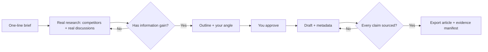

# seo-writer

[](LICENSE)
[](https://github.com/xuhouchang/seo-writer)
[](https://github.com/xuhouchang/seo-writer)

> Stop publishing SEO articles that rank for nothing.
> seo-writer turns a one-line brief into content with **real information gain, sourced claims, and a human sign-off** — the kind Google actually rewards.

seo-writer is a **local-first content workflow**. You hand it a topic; it runs a *research → gate → human approval → draft* process and produces an article that's ready to publish — and ready to rank.

No subscription. No data leaving your computer. Nothing published without your okay.

---

## The SEO problem you already know

- **You ship 10 AI articles and none of them rank.** Google reads them as thin, generic, and recycled — and the Helpful Content system pushes them down.
- **Your content sounds like everyone else's.** It's a blend of the current top 10, so it has **zero information gain** — there's no reason for Google to rank *you* over them.
- **Bold claims with no source.** "Industry-leading", "studies show…" with nothing behind it. That wrecks **E-E-A-T** — and in finance, health, or B2B it's a compliance problem, not just a quality one.
- **You write blind.** No idea what people actually search, what's trending, or where the gaps are — so you target demand that isn't there.
- **Nothing gets reviewed before it goes live.** A risky sentence or a wrong stat ships, and you find out after.
- **Your search data and your writing live in two different tools** that never talk to each other.

---

## What seo-writer gives you

- **Information gain, enforced.** Before a word is drafted, it has to answer one question: *what does this add versus what already ranks?* — a sharper angle, a source competitors missed, a better answer.
- **Every claim is sourced.** Each brand keeps a **facts ledger** — statements your team has actually approved. Any substantive claim with no citation is **blocked from publishing**, and the exact sentence is flagged.
- **A human in the loop, every time.** The outline stops and waits for **your approval** before drafting continues. Change a fact or a policy and the old approval **expires automatically** — nothing gets a silent pass.
- **Your real search data, put to work.** Connect **Google Search Console** to see which queries get impressions but no clicks, what's gaining, and where you're weak. Run a **0–100 site audit** to find where this round can actually win.

---

## How a ranking-ready article gets made



Everything runs on your machine, and every step is logged. There's no "auto-posted in the background" surprise.

---

## Generic AI article vs. a seo-writer article

> ❌ Generic: *"In today's digital era, the X industry faces unprecedented opportunities…"* — says nothing, ranks for nothing.
>
> ✅ seo-writer: *"The 3 buyer types we see all hit the same wall — and none of the top results explain it."* — has a position, has sources, has a reason to rank.

---

## Who this is for

- **SEO / content / marketing operators** who want AI speed without the "AI slop" that doesn't move rankings.
- **Content teams and agencies** where every published claim has to be defensible to a client, with an approval trail.
- **Founders and compliance owners** who can't afford one unsourced sentence causing trouble.
- **Teams already on Coze / agents** — point the agent at the workflow and the same gates still catch it.

No SaaS. No monthly fee. No data leaves your computer.

---

## Privacy and security (your client-facing proof)

- The repository **never contains any key, account, or credential**.
- Your accounts and data live in a local folder on **your own machine** — nothing is sent to any third party.
- The example brand pack is deliberately anonymous placeholder data. **Never commit a client's real facts ledger into the repo.**

---

## Quick start (for the person who installs it)

```bash
git clone https://github.com/xuhouchang/seo-writer.git
cd seo-writer
uv sync --frozen

export SEO_WRITER_HOME="$PWD"
alias sw="$SEO_WRITER_HOME/bin/seo-writer --data-dir ~/.seo-writer"

sw init
sw brand create acme
sw project create acme blog
sw brand facts import acme examples/brand-packs/generic-acme/facts.yaml
sw brand policy import acme examples/brand-packs/generic-acme/policy.yaml
sw run create acme blog --brief examples/brand-packs/generic-acme/topics/workflow-decisions.yaml
sw run research <run-id>
sw run validate-research <run-id>
sw run outline <run-id> --from-file outline.md
sw run approve <run-id> --revision 1 --approver "you@example.com"
sw run draft <run-id> --from-file draft.md
sw run metadata <run-id> --from-file metadata.yaml
sw run validate <run-id>
sw run export <run-id> --format markdown
```

Want real search and community signals? Configure **DataForSEO + Reddit** once, and the same commands run on live evidence. Full command reference: `seo-writer --help`.

---

## Want the agent workflow or the technical design?

- `skills/seo-writer/` — the article production workflow (an agent follows it and won't get rejected)
- `skills/seo-writer-onboarding/` — onboard a new brand + connect Search Console
- [`docs/WHY.md`](docs/WHY.md) — the full problem and thesis
- [`docs/ARCHITECTURE.md`](docs/ARCHITECTURE.md) — technical design
- [`docs/RELEASE.md`](docs/RELEASE.md) — install / upgrade / release gates
- [`docs/MIGRATION.md`](docs/MIGRATION.md) — configure real research sources

---

License: MIT
